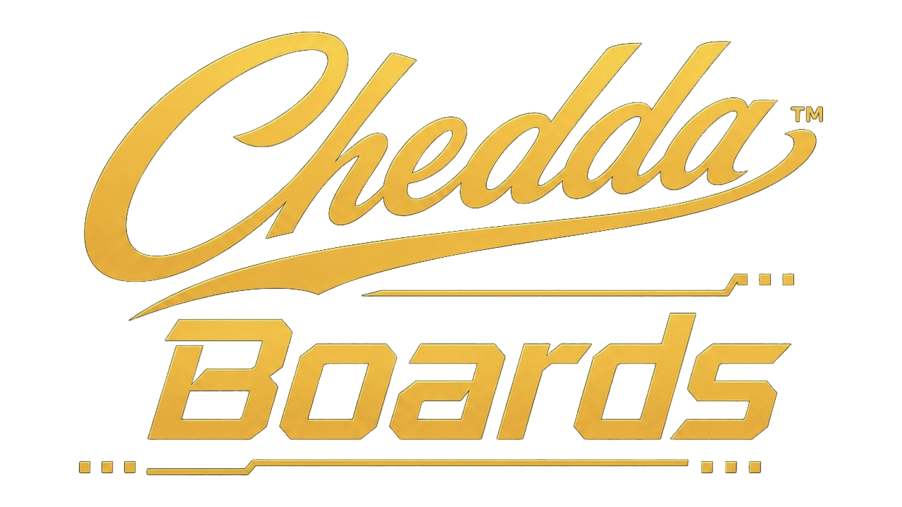

<p align="center">
  
</p>

# CheddaBoards Unity SDK

> **⚠️ BETA** — This SDK is under active development and testing. The API may change. Feedback welcome via [Issues](https://github.com/cheddatech/CheddaBoards-Unity/issues) or [@cheddatech](https://x.com/cheddatech).

**Leaderboards, achievements, and auth for Unity. Any platform. 3-minute setup.**

Drop-in C# SDK for [CheddaBoards](https://cheddaboards.com) — permanent, serverless gaming infrastructure powered by the Internet Computer.

[](https://cheddaboards.com)
[](LICENSE)
[]()

---

## What's new in 2.2

- **Category Scoreboards** — `SubmitScoreToBoard(boardId, score, streak)` writes to one specific board (per-level / per-mode / per-category) without fanning out. See [Scores & Leaderboards](#scores--leaderboards).
- **⚠️ Breaking:** `OnProfileLoaded` now passes a 5th argument, `playCount`. Update 4-arg handlers to `(nickname, score, streak, achievements, playCount)`.
- **⚠️ Breaking:** `OnDeviceCodeReceived` now passes a 3rd argument, `qrDataUrl` (a base64 PNG QR code you can display). Update 2-arg handlers to `(code, url, qrDataUrl)`.
- `debugLogging` now defaults to `false` — set it `true` while developing.
- `GetNickname()` returns `""` for unnamed anonymous players, so you can show "Guest" instead of a generated placeholder.

---

## Features

- **Leaderboards** — All Time, Weekly, Daily, Monthly, and custom-interval, with automatic archiving
- **Category Scoreboards** — Targeted per-level / per-mode boards; submit to one board by ID
- **Achievements** — Unlock tracking with batch sync support
- **Multi-Auth** — Anonymous, Google, Apple, Internet Identity via Device Code flow
- **Play Sessions** — Server-side time validation for anti-cheat
- **Cross-Game Profiles** — Players keep one identity across all CheddaBoards games
- **Account Migration** — Upgrade anonymous accounts to verified without losing data
- **HTTP-Only** — No JavaScript bridges. Works identically on all platforms
- **Zero Dependencies** — Pure UnityWebRequest. No third-party packages required

---

## Quick Start

### 1. Add to your project

Copy `CheddaBoards.cs` into your Unity project (e.g. `Assets/Scripts/CheddaBoards.cs`).

### 2. Configure

```csharp
var cb = CheddaBoards.Instance; // Auto-creates singleton GameObject
cb.SetApiKey("your-api-key");
cb.SetGameId("your-game-id");
```

Get your API key and game ID from the [CheddaBoards Dashboard](https://cheddaboards.com).

### 3. Login and submit scores

```csharp
void Start()
{
    var cb = CheddaBoards.Instance;
    cb.SetApiKey("your-api-key");
    cb.SetGameId("your-game-id");

    cb.OnLoginSuccess += (nickname) => Debug.Log($"Welcome {nickname}!");
    cb.OnScoreSubmitted += (score, streak) => Debug.Log($"Score saved: {score}");

    cb.LoginAnonymous("PlayerName");
}

void OnGameOver(int score, int streak)
{
    CheddaBoards.Instance.SubmitScore(score, streak);
}
```

That's it. Leaderboard data is permanently stored on-chain.

---

## Authentication

### Anonymous Login

Instant login with a persistent device ID. No account creation needed.

```csharp
cb.OnLoginSuccess += (nickname) => Debug.Log("Logged in: " + nickname);
cb.OnLoginFailed += (error) => Debug.Log("Failed: " + error);

cb.LoginAnonymous("PlayerName");
```

> **Nickname rules (server-enforced):** 3–16 characters, letters, numbers, and
> underscores. Anything else is rejected on nickname changes; names supplied at
> login are sanitized server-side. If a name is already taken, the server
> assigns a suffixed variant (e.g. `Player_1`).

### Social Login (Google / Apple / Internet Identity)

Uses the Device Code Auth flow (RFC 8628) — works on every platform including consoles, VR, and native builds. No browser pop-ups needed in-game.

```csharp
// code/url let the player authorise at cheddaboards.com/link.
// qrDataUrl is a base64 PNG data URL — display it as a scannable QR, or just show the code.
cb.OnDeviceCodeReceived += (code, url, qrDataUrl) =>
{
    codeLabel.text = $"Go to {url}\nEnter code: {code}";
};

cb.OnDeviceCodeApproved += (nickname) =>
{
    Debug.Log($"Welcome {nickname}!");
    // Player is now authenticated with their social account
};

cb.OnDeviceCodeExpired += () => Debug.Log("Code expired, try again");

cb.LoginWithDeviceCode();
```

### Account Migration

Upgrade an anonymous player to a verified account without losing scores or achievements. Scores and streaks merge by maximum, achievements are deduplicated, and play counts are summed — linking the same account from a second device merges cleanly.

```csharp
cb.OnAccountUpgraded += (oldProfile, newProfile) =>
{
    Debug.Log("Account upgraded! Scores preserved.");
};

cb.MigrateAnonymousToCurrent(anonymousDeviceId);
```

---

## Scores & Leaderboards

### Submit a Score

```csharp
cb.OnScoreSubmitted += (score, streak) => Debug.Log($"Saved: {score}");
cb.OnScoreError += (error) => Debug.Log($"Error: {error}");

cb.SubmitScore(1500, 5); // score, streak
```

`SubmitScore` fans the score out to every standard board on your game (all-time, weekly, daily…).

### Submit to a Specific Board (Category Scoreboards)

For per-level, per-mode, or per-category leaderboards, submit to one board by ID. Unlike `SubmitScore`, this writes to that board **only** — it does not fan out to your other boards or touch the player's overall profile total.

```csharp
cb.OnScoreSubmittedToBoard += (boardId, score, streak) => Debug.Log($"Saved to {boardId}: {score}");

cb.SubmitScoreToBoard("level-14", 1500, 5); // boardId, score, streak
```

The board must be configured as **targeted** in the dashboard. You can call it several times in a row for different boards (e.g. a per-level board plus a shared `runs` board). Failures come back on `OnScoreError`.

### Submit Score with Achievements

Achievements sync automatically after the score is confirmed:

```csharp
var achievements = new List<string> { "first_win", "high_scorer", "streak_5" };
cb.SubmitScoreWithAchievements(2000, 10, achievements);
```

### Get Scoreboards

```csharp
// Time-based scoreboards
cb.OnScoreboardLoaded += (id, config, entries) =>
{
    foreach (Dictionary<string, object> entry in entries)
    {
        Debug.Log($"#{entry["rank"]} {entry["nickname"]}: {entry["score"]}");
    }
};

cb.GetWeeklyLeaderboard();
cb.GetDailyLeaderboard();
cb.GetAlltimeLeaderboard();
cb.GetMonthlyLeaderboard();

// Or by scoreboard ID — works for any board, timed or targeted
cb.GetScoreboard("weekly", 100);
cb.GetScoreboard("level-14", 100);
```

### Get Player Rank

```csharp
cb.OnScoreboardRankLoaded += (scoreboardId, rank, score, streak, total) =>
{
    Debug.Log($"You are #{rank} out of {total} players");
};

cb.GetScoreboardRank("weekly");
```

### Browse Archives

View previous periods (last week's results, last month, etc.):

```csharp
cb.OnArchivedScoreboardLoaded += (archiveId, config, entries) =>
{
    Debug.Log($"Archive from {config["periodStart"]} to {config["periodEnd"]}");
};

cb.GetLastWeekScoreboard();
cb.GetLastMonthScoreboard();
cb.GetYesterdayScoreboard();
```

---

## Achievements

```csharp
cb.OnAchievementUnlocked += (id) => Debug.Log($"Unlocked: {id}");

// Single
cb.UnlockAchievement("first_win");

// Batch
cb.UnlockAchievementsBatch(new List<string> { "first_win", "speed_run" });

// Load player's achievements
cb.OnAchievementsLoaded += (achievements) => Debug.Log($"Got {achievements.Count} achievements");
cb.GetAchievements();
```

---

## Play Sessions (Anti-Cheat)

Server-side time validation ensures scores match actual play time:

```csharp
cb.OnPlaySessionStarted += (token) => Debug.Log("Session started");

// Start when gameplay begins
cb.StartPlaySession();

// Submit score — play session token is attached automatically
// (applies to both SubmitScore and SubmitScoreToBoard)
cb.SubmitScore(score, streak);

// End when player quits or pauses
cb.EndPlaySession();
```

---

## Events Reference

| Event | Parameters | Description |
|-------|-----------|-------------|
| `OnSdkReady` | — | SDK initialised |
| `OnLoginSuccess` | `nickname` | Login completed |
| `OnLoginFailed` | `error` | Login failed |
| `OnLogoutSuccess` | — | Logged out |
| `OnScoreSubmitted` | `score, streak` | Score saved (fan-out) |
| `OnScoreSubmittedToBoard` | `boardId, score, streak` | Targeted score saved to one board |
| `OnScoreError` | `error` | Score submission failed |
| `OnScoreboardLoaded` | `id, config, entries` | Scoreboard data received |
| `OnScoreboardRankLoaded` | `id, rank, score, streak, total` | Player rank received |
| `OnAchievementUnlocked` | `achievementId` | Achievement unlocked |
| `OnAchievementsLoaded` | `achievements` | Achievement list received |
| `OnPlaySessionStarted` | `token` | Play session active |
| `OnDeviceCodeReceived` | `code, url, qrDataUrl` | Device code ready to display |
| `OnDeviceCodeApproved` | `nickname` | Social login completed |
| `OnDeviceCodeExpired` | — | Code timed out |
| `OnAccountUpgraded` | `oldProfile, newProfile` | Migration completed |
| `OnProfileLoaded` | `nickname, score, streak, achievements, playCount` | Profile data received |
| `OnNicknameChanged` | `nickname` | Nickname updated |
| `OnArchivesListLoaded` | `scoreboardId, archives` | Archive list received |
| `OnArchivedScoreboardLoaded` | `archiveId, config, entries` | Archived scoreboard data |

---

## Utility Methods

```csharp
cb.IsAuthenticated()     // true if logged in
cb.HasAccount()          // true if logged in with a non-anonymous account
cb.IsAnonymous()         // true if using anonymous auth
cb.CanConnect()          // true if API key or session is set
cb.GetNickname()         // current nickname ("" for unnamed anonymous — show "Guest")
cb.GetHighScore()        // cached high score
cb.GetBestStreak()       // cached best streak
cb.GetPlayCount()        // cached play count
cb.GetPlayerId()         // persistent device ID
```

---

## Configuration

| Property | Default | Description |
|----------|---------|-------------|
| `apiKey` | — | Your CheddaBoards API key |
| `gameId` | — | Your game ID |
| `debugLogging` | `false` | Enable verbose console logging (set `true` while developing) |

The SDK auto-creates a singleton `GameObject` with `DontDestroyOnLoad`. No manual scene setup required.

---

## Platform Support

The SDK is HTTP-only — it works identically everywhere Unity runs:

- Windows, Mac, Linux
- iOS, Android
- WebGL
- Consoles
- VR/AR

---

## Links

- **Website**: [cheddaboards.com](https://cheddaboards.com)
- **Docs**: [Godot SDK repo → /docs](https://github.com/cheddatech/CheddaBoards-Godot/tree/main/docs)
- **HTTP API reference**: [quickstart-api](https://github.com/cheddatech/CheddaBoards-Godot/blob/main/docs/quickstart-api.md) — the same REST API this SDK wraps
- **Godot SDK**: [CheddaBoards-Godot](https://github.com/cheddatech/CheddaBoards-Godot)
- **Backend (open source)**: [cheddaboards](https://github.com/cheddatech/cheddaboards) — the canister this all runs on
- **Company**: [cheddatech.com](https://cheddatech.com)
- **X**: [@cheddatech](https://x.com/cheddatech)

---

## License

MIT — see [LICENSE](LICENSE)

---

**Built by [CheddaTech Ltd](https://cheddatech.com) on the Internet Computer.**
